# SAC + GAIL 模仿学习完整训练报告

> 环境：MountainCarContinuous-v0 | 算法：SAC + GAIL + GASILfD | 总步数：50k | eval@5k | seed=1
> 设备：CPU（沙箱限制 GPU 访问）

---

## 目录

1. [训练流水线概述](#1-训练流水线概述)
2. [Stage 1：SAC 训练与专家数据生成](#2-stage-1sac-训练与专家数据生成)
3. [Stage 2：BC 行为克隆](#3-stage-2bc-行为克隆)
4. [Stage 3：GAIL 训练演进历程](#4-stage-3gail-训练演进历程)
5. [数学分析：$r=-\log(D)$ 的 label 方向](#5-数学分析r-logd-的-label-方向)
6. [GASILfD 理论基础](#6-gasilfd-理论基础)
7. [关键技巧实现细节](#7-关键技巧实现细节)
8. [最终方案 v6 实验结果](#8-最终方案-v6-实验结果)
9. [消融实验：主导技巧分析](#9-消融实验主导技巧分析)
10. [最终算法步骤（mermaid 流程图）](#10-最终算法步骤mermaid-流程图)
11. [最终代码结构与参数](#11-最终代码结构与参数)
12. [TensorBoard 访问](#12-tensorboard-访问)

---

## 1. 训练流水线概述

三阶段训练流水线：

1. **Stage 1 (SAC)**：训练 SAC 智能体作为专家策略，生成专家演示数据
2. **Stage 2 (BC)**：用行为克隆从专家数据中训练初始策略网络
3. **Stage 3 (SAC-GAIL)**：以 BC 策略为初始策略，结合专家数据进行 GAIL 对抗模仿学习

---

## 2. Stage 1：SAC 训练与专家数据生成

### 2.1 训练配置

| 参数 | 值 |
|---|---|
| 总步数 | 50,000 |
| 网络结构 | [256, 256] |
| 学习率 | actor=critic=alpha=3e-4 |
| gamma | 0.99 |
| tau | 0.005 |
| 初始 alpha | 1.0（autotune） |
| log_std_init | -3 |
| gSDE | 启用 |
| 正交初始化 | 关闭 |
| clip_mean | 2.0 |
| target_network_frequency | 1 |
| policy_frequency | 1 |
| train_freq / gradient_steps | 32 / 32 |
| batch_size | 64 |
| learning_starts | 1,000 |
| 观测归一化 | 启用（RunningMeanStd） |

### 2.2 与 SB3 基线对齐

最初 `train_sac.py` 与 `train_sac_sb3.py` 存在 7 处差异导致训练结果不同：

| 差异 | train_sac.py (修改前) | SB3 SAC | 影响 |
|---|---|---|---|
| **初始 alpha** | 0.2 | **1.0** | **最关键**：alpha=0.2 探索不足，早期易陷入局部最优 |
| log_std_init | 0 | **-3** | log_std=0 噪声过大，破坏策略稳定性 |
| policy_frequency | 2 | **1** | 策略更新频率过高加剧对抗振荡 |
| train_freq / gradient_steps | 1 / 2 | **32 / 32** | 批量更新更稳定 |
| batch_size | 256 | **64** | SB3 小批量梯度噪声更大反而更鲁棒 |
| learning_starts | 5,000 | **1,000** | 早期开始学习更快 |
| 正交初始化 | 启用 | **关闭** | 正交初始化在该任务上无益 |

修改后 `train_sac.py` 与 SB3 对齐：eval return 94.3~94.6，成功率 100%。

### 2.3 训练结果

| 评估点 | 成功率 | 平均回报 |
|---|---|---|
| eval@5000 | 100.0% | 97.0±0.4 |
| eval@10000 | 0.0% | -7.9±0.1 |
| eval@15000 | 100.0% | 93.8±0.2 |
| eval@50000 | 100.0% | 94.4±0.4 |
| **final eval** | **100.0%** | **94.6±0.3** |

10k 步处出现临时性能崩溃（alpha=1.0 导致的探索过度），15k 步后恢复。

### 2.4 专家数据

| 属性 | 值 |
|---|---|
| 文件 | `mountaincar_expert_data.npz` |
| 轨迹数 | 100 |
| 状态-动作对 | 88,444 |
| 状态维度 | (88444, 2) |
| 动作维度 | (88444, 1) |
| 成功轨迹（<1000步） | 63/100 (63%) |
| 平均轨迹长度 | 884.4 步 |

---

## 3. Stage 2：BC 行为克隆

### 3.1 训练配置

| 参数 | 值 |
|---|---|
| 网络结构 | [128, 128] |
| 学习率 | 1e-3 |
| weight_decay | 6e-2 |
| epochs | 500 |
| batch_size | 64 |
| 训练/验证划分 | 80% / 20% |
| log_std_init | -3.67 |
| gSDE | 启用 |
| 优化器 | AdamW (eps=1e-5) |
| 早停 | patience=100 |

### 3.2 训练结果

| 指标 | 值 |
|---|---|
| 最终 train_loss | 0.0000 |
| 最终 val_loss | 0.0000 |
| **测试成功率** | **60.0%** |
| **测试平均回报** | **22.22** |

BC 策略 60% 的成功率与专家数据 63% 的成功率基本一致，提供了有用的初始策略。

---

## 4. Stage 3：GAIL 训练演进历程

### 4.1 最初版本：train_sac_gail.py（不稳定）

| 参数 | 值 |
|---|---|
| 总步数 | 100,000 |
| 初始 alpha | 0.2 |
| log_std_init | 0 |
| policy_frequency | 2 |
| disc_epochs | 2 |
| GAIL 奖励 | -log(1-D) |
| env_reward_weight | 0.3 |

| 评估点 | 成功率 | 平均回报 |
|---|---|---|
| eval@10000 | 95.0% | 63.4±23.4 |
| **eval@15000** | **100.0%** | **77.0±2.2** |
| eval@20000 | **0.0%** | -26.1±0.9 |
| eval@100000 | 0.0% | -13.0±0.1 |

**15k~20k 步发生灾难性崩溃**，原因：
1. 判别器过强（disc_epochs=2）导致奖励信号退化
2. 初始 alpha=0.2 探索不足，策略过早收敛
3. log_std_init=0 噪声过大，破坏 BC 初始化
4. policy_frequency=2 加剧对抗振荡

### 4.2 改进版：v4_fix（稳定，混合奖励）

通过以下改进达到稳定 100% success：

| 改进 | 旧值 | 新值 |
|---|---|---|
| 初始 alpha | 0.2 | **1.0** |
| log_std_init | 0 | **-3** |
| policy_frequency | 2 | **1** |
| disc_epochs | 2 | **1** |
| disc_lr | 3e-4 | **1e-4** |
| 正交初始化 | 启用 | **关闭** |
| env_reward_weight | 0.3 | **0.3** |
| GAIL 奖励 | $-\log(1-D)$ | **$-\log(1-D)$** |

结果：10k~50k 全程 100% success，return 94.3~94.7。

### 4.3 混合奖励消融：$w=0$ 失败

将 `env_reward_weight` 从 0.3 改为 0.0（纯 GAIL，不使用环境奖励），其他不变：

| step | $w=0.3$ (混合) | $w=0.0$ (纯GAIL) |
|---|---|---|
| 10k | 100% (94.3) | 0% (-38.1) |
| 15k | 100% (94.4) | 0% (-41.2) |
| 50k | 100% (94.7) | 0% (-16.7) |

**纯 GAIL（w=0）在 MountainCar 上失败**，判别器奖励无法提供足够的任务方向锚定。

### 4.4 奖励公式实验：$r=-\log(D)$ vs $r=-\log(1-D)$

| 公式 | $D \to 1$（像专家） | $D \to 0$（不像专家） | 效果 |
|---|---|---|---|
| $r = -\log(1-D)$（标准） | $r \to +\infty$ | $r \to 0$ | 奖励像专家的行为 |
| $r = -\log(D)$ | $r \to 0$ | $r \to +\infty$ | 奖励不像专家的行为（反模仿） |

在标准 label（$D=P(\text{expert})$）下，$r=-\log(D)$ 是反模仿。需反转 label 使 $D=P(\text{policy})$，$r=-\log(D)$ 才是正模仿。

### 4.5 WGAN-GP 实验

将判别器替换为 WGAN-GP（Wasserstein GAN with Gradient Penalty）：
- 用 Wasserstein 距离替代 BCE
- 添加梯度惩罚项（$\lambda=10$）
- 奖励直接用 $-D(s,a)$

结果：WGAN-GP 在 MountainCar 上同样无法稳定训练，判别器梯度惩罚过大导致 critic 更新不稳定。

---

## 5. 数学分析：$r=-\log(D)$ 的 label 方向

### 5.1 标准 GAIL label

标准 GAIL 中 $D(s,a) = P(\text{expert}|s,a)$，判别器训练时：
- expert → label=1（让 $D \to 1$）
- policy → label=0（让 $D \to 0$）

标准 GAIL 奖励 $r = -\log(1-D)$：$D \to 1$（像专家）→ $r \to +\infty$（正模仿）

### 5.2 $r=-\log(D)$ 的方向矛盾

若保持标准 label，$r = -\log(D)$：$D \to 1$（像专家）→ $r \to 0$（最小奖励）→ **反模仿**

### 5.3 解决方案：label 反转

由于奖励形式固定为 $r = -\log(D)$，判别器标签直接采用反转配置：
- expert → label=0
- policy → label=1

此时 $D(s,a) = P(\text{policy}|s,a)$，$r = -\log(D)$：$D \to 0$（不像策略=像专家）→ $r \to +\infty$（正模仿）

```python
# discriminator.py update() — label 反转（固定）
expert_loss = BCE(expert_d, smoothing)         # expert → label=0
policy_loss = BCE(policy_d, 1-smoothing)       # policy → label=1
```

**数学等价性**：label 反转 + $r=-\log(D)$ 等价于标准 label + $r=-\log(1-D)$。

---

## 6. GASILfD 理论基础

> 本章基于本项目的**标签反转配置**推导：expert → label=0，policy → label=1，即 $D(s,a)=P(\text{policy}|s,a)$，奖励 $r=-\log(D)$。
> 当策略行为像专家时 $D \to 0$，$r=-\log(0) \to +\infty$（正模仿奖励）；当策略行为像自己时 $D \to 1$，$r=-\log(1)=0$（无奖励）。

### 6.1 问题背景：GAIL 的判别器饱和与自模仿危机

在标签反转配置下，标准 GAIL（静态专家池）训练过程中存在一个根本性矛盾：

1. **判别器饱和**：随着训练进行，判别器逐步学会区分专家与策略。由于 $D=P(\text{policy}|s,a)$，判别器对专家数据输出趋于 0（$D(\text{expert}) \to 0$，"不像策略"），对策略数据输出趋于 1（$D(\text{policy}) \to 1$，"像策略"）。判别器"记住"专家分布而丧失区分能力。
2. **奖励退化**：奖励 $r=-\log(D)$。当 $D(\text{policy}) \to 1$ 时，$r=-\log(1)=0$，策略得不到任何正模仿奖励，训练信号消失，策略无法继续优化。这正是本项目 v5_fix（无技巧）在 15k 步崩溃的根因（参见 8.4 节）。
3. **探索-模仿冲突**：为突破稀疏奖励环境（如 MountainCarContinuous），策略需要主动探索新状态获取成功。但标准 GAIL 目标是最小化策略与专家分布的 JS 散度，探索产生的新成功轨迹反而被判别器判为 $D \to 1$（像策略），得到 $r \approx 0$ 的低奖励，形成"探索→成功→零奖励→放弃探索"的负循环。

### 6.2 GASILfD 核心思想

**GASILfD（Generative Adversarial Self-Imitation Learning from Demonstrations）** 的核心机制是**动态扩展专家池**：

> 将策略自身产生的高质量成功轨迹追加到专家池 $P_e$ 中（赋予 label=0），使判别器同时面对"传统专家"和"策略自己的专家"，从而将 $D(\text{expert})$ 从 0 推高、将 $D(\text{policy})$ 从 1 拉低，使两者收敛到 0.5 附近，防止判别器饱和。

#### 数学推导

判别器的目标函数（标签反转配置）为：

$$
L_D = \mathbb{E}_{(s,a) \sim P_e}\big[\text{BCE}(D(s,a), 0)\big] + \mathbb{E}_{(s,a) \sim P_\pi}\big[\text{BCE}(D(s,a), 1)\big]
$$

其中 $P_e$ 是专家分布（label=0），$P_\pi$ 是策略分布（label=1），$D=P(\text{policy}|s,a)$。

在标准 GAIL 中，$P_e$ 是**静态的**（固定专家数据集）。当策略逐步学会专家行为后，判别器能完美区分两者：
- $D(P_e) \to 0$：判别器确信专家"不像策略"
- $D(P_\pi) \to 1$：判别器确信策略"像策略"

此时判别器饱和，BCE 梯度消失，且策略的奖励 $r=-\log(D(P_\pi)) \to 0$，训练停滞。

GASILfD 将 $P_e$ 改为**动态的**：$P_e = P_{e,\text{original}} \cup P_{e,\text{self\_imitation}}$，其中 $P_{e,\text{self\_imitation}}$ 是策略成功产生的高质量轨迹（同样赋予 label=0）。

当策略成功产生新轨迹 $\tau$ 时：
1. $\tau$ 被追加到 $P_e$ 中，目标 label=0
2. $\tau$ 本身是策略产生的，特征上接近 $P_\pi$，但被判别器要求输出 $D \to 0$
3. 判别器为使 $\tau$ 的输出接近 0，必须学习"策略成功轨迹的特征 → 0"，这会将 $D(P_e)$ 从 0 推高（因为 $P_e$ 中混入了策略化数据）
4. 同时，由于策略成功轨迹既出现在 $P_e$(label=0) 又可能出现在 $P_\pi$(label=1)，判别器无法区分，被迫将 $D(P_\pi)$ 从 1 拉低
5. 最终 $D(P_e) \approx D(P_\pi) \approx 0.5$，判别器保持在最灵敏的区间，BCE 梯度最大

#### 自模仿正循环

GASILfD 在标签反转配置下形成以下正循环：

```
策略探索 → 发现新成功(s,a) → 追加到P_e(label=0) → 判别器混淆 → D(policy)↓ → r=-log(D)↑ → 策略获正奖励 → 更愿意探索
    ↑                                                                                    │
    └──────────────────── 维持 D(exp)≈D(pol)≈0.5 ←────────────────────────────────────────┘
```

关键点：在反转配置下，$D(\text{policy}) \downarrow$（从 1 拉向 0.5）意味着策略行为被判别器认为"更像专家"，奖励 $r=-\log(D) \uparrow$（从 0 升到 $-\log(0.5) \approx 0.69$），策略获得持续的正模仿信号。

这个循环确保：
- 判别器始终有梯度信号（在 $D=0.5$ 附近 BCE 损失梯度最大）
- 探索获得的成功被正反馈（$D \downarrow \Rightarrow r \uparrow$），而非被惩罚
- 专家池持续丰富，覆盖越来越多的成功模式

### 6.3 GASILfD 的关键设计

基于 GASILfD 系列论文（Category-Level GAIL + Self-Imitation），我们提取出 3 个关键设计：

#### Trick 1：生成器回放池初始化包含专家（$B_G \subset B_E$）

> 论文 Algorithm Step 6: Set the replay buffer $B_G \leftarrow \text{SAC}_{B_E} \text{ using } \tau_G$

**理论依据**：SAC 是 off-policy 算法，Critic 的值函数估计依赖回放池中的样本。如果回放池 $B_G$ 在训练开始时为空，Critic 只能通过随机探索获得样本，导致早期值函数估计偏差大。通过从专家池 $B_E$ 预填充 $B_G$，Critic 在第一次 TD 更新时就见过专家行为，学到正确的值函数先验，加速收敛。

#### Trick 2：自模仿使用 setpoint 阈值

> 论文 Algorithm Step 7: Select expert buffer $B_E$ using "the setpoint threshold"

**理论依据**：并非所有成功轨迹都适合加入专家池。例如在 MountainCarContinuous 中，策略可能"碰巧"到达旗子（env_return 刚过 100），但并未真正学会能量积累+冲顶的完整策略。setpoint 阈值 `env_return > 90` 确保只有高质量成功轨迹被追加，防止"低质量专家"污染判别器，避免 $D(P_e)$ 被错误数据扰乱。

#### Trick 3：GAIL 奖励 RunningMeanStd z-score 归一化

> 论文 $V_{\text{CGAL}}$ 公式中 $\tau$ 级别求和隐含的归一化

**理论依据**：GAIL 奖励 $r=-\log(D(s,a))$ 的量级随判别器状态剧烈变化。在反转配置下，当 $D \to 0$（策略像专家）时 $r \to +\infty$，当 $D \to 1$（策略像自己）时 $r \to 0$。这种量级漂移导致 Critic 的 TD 目标不稳定，值函数估计被偶发的高奖励主导。z-score 归一化 $r_{\text{normed}} = \frac{r - \mu}{\sigma + \epsilon}$ 将奖励统计量强制拉回到 $\mathcal{N}(0,1)$，消除量级漂移，使 Critic 的值函数估计保持稳定。

### 6.4 与纯 GAIL（$w=0$）的协同作用

当 `env_reward_weight=0`（$w=0$）时，策略仅依赖 GAIL 奖励学习。此时 GASILfD 的作用尤为关键：

1. **纯 GAIL 无环境奖励锚点**：策略的所有学习信号来自判别器，判别器一旦饱和（$D(\text{policy}) \to 1$），奖励 $r \to 0$，训练立即崩溃
2. **GASILfD 维持判别器灵敏度**：通过动态扩展专家池，将 $D(\text{policy})$ 从 1 拉回 0.5 附近，确保 $r=-\log(D) \approx 0.69$ 保持有效信号
3. **z-score 归一化稳定奖励量级**：即使 $r=-\log(D)$ 的绝对量级变化，归一化后的值始终 $\approx \mathcal{N}(0,1)$
4. **setpoint 阈值保证专家质量**：避免低质量成功轨迹导致 $D(P_e)$ 被扰乱，维持判别器平衡

---

## 7. 关键技巧实现细节

以下 3 个技巧对应 GASILfD 理论基础中的 6.3 节，此处补充实现细节与代码位置。

### Trick 1：生成器回放池初始化包含专家 (B_G ⊂ B_E)

> 论文 Algorithm Step 6: `Set the replay buffer B_G ← SAC B_E using τ_G`

在训练开始前，将专家 (s,a) 样本预填充到生成器回放池 `buffer_g` 中，让 Critic 在第一次 TD 更新时就见过专家行为，学到正确的值函数先验。

### Trick 2：自模仿使用 setpoint 阈值

> 论文 Algorithm Step 7: `Select expert buffer B_E using "the setpoint threshold"`

只有 `env_return > 90`（真正学会能量积累+冲顶）的高质量成功轨迹才加入专家池，排除"运气碰旗子"的低质量成功。

### Trick 3：GAIL 奖励 RunningMeanStd z-score 归一化

> 论文 V_CGAL 公式中 τ 级别求和隐含的归一化

对 GAIL 奖励做在线 z-score：`r_normed = (r - μ) / (σ + ε)`，使每步 reward 统计上 ≈ N(0,1)，防止 D 值漂移导致 reward 量级暴增。

---

## 8. 最终方案 v6 实验结果

### 8.1 配置

```
奖励形式：r = -log(D(s,a))（discriminator.py 中固定，label 反转：expert→0, policy→1，D=P(policy)）
纯 GAIL：env_reward_weight=0（rl_utils.py 中默认）
Trick 1: buffer_g 预填充 5000 条专家 (s,a)
Trick 2: success_threshold = 90.0
Trick 3: gail_reward_runnorm = True (RunningMeanStd z-score)
稳定性：alpha_min=0.08, gasilf_cap=200, reward_clip=5.0, reward_scale=0.5
```

### 8.2 50k 完整结果

| step | v4_fix ($w=0.3$ baseline) | v5_fix ($w=0$ 无技巧) | **v6 ($w=0$ + 3技巧)** |
|---:|---|---|---|
| 10k | 100% (94.3) | 0% (-38.1) | **100% (94.4)** |
| 15k | 100% (94.4) | 0% (-41.2) | **100% (94.4)** |
| 20k | 100% (95.0) | 0% (-21.8) | **100% (94.4)** |
| 25k | 100% (95.5) | 0% (-26.6) | **100% (94.8)** |
| 50k | 100% (94.7) | 0% (-16.7) | **100% (94.4)** |

### 8.3 关键指标对比

| 指标 | v5_fix (失败) | v6 (成功) | 改善 |
|---|---|---|---|
| 15k gail_return | 310 (暴增9×) | 75 (稳定) | **T3 z-score 归一化** |
| 15k gasilf | 20 (停滞) | 99 (持续增长) | **T2 setpoint threshold** |
| 15k env_return | -44 (崩溃) | 95 (稳定) | **3技巧组合** |
| 15k alpha | 0.08 (坍缩) | 0.23 (健康) | **T3 防止 reward 暴增** |

### 8.4 v5_fix 失败根因：GAIL 奖励量级暴增

| step | env_return | gail_return | gasilf | eval success |
|---:|---|---|---|---|
| 10k | 91.3 | 61.2 | 20 | 0% |
| 15k | **-44.5** | **310.4** | 20（停滞） | 0% |

**崩溃链**：
1. 10k 训练中策略偶然成功（env_return=91.3），但 eval=0%（依赖 gSDE 噪声）
2. GAIL 奖励量级从 33→310（**9.3 倍暴增**），Critic 被高量级 reward 主导
3. alpha 坍缩到 0.08（下限），gSDE 探索归零
4. gasilf 停滞在 20，自模仿正循环断裂
5. env_return 崩溃到 -44

---

## 9. 消融实验：主导技巧分析

### 9.1 实验设计

| 实验 | Trick 1 (prefill) | Trick 2 (threshold=90) | Trick 3 (runnorm) |
|---|---|---|---|
| T1only | ✅ | ❌ (threshold=0) | ❌ |
| T2only | ❌ | ✅ | ❌ |
| T3only | ❌ | ❌ (threshold=0) | ✅ |

### 9.2 消融结果

| step | T1only | T2only | **T3only** |
|---:|---|---|---|
| 10k | 100% (93.8) gasilf=17 | 100% (90.7) gasilf=20 | **100% (94.3) gasilf=63** |
| 15k | **0% (-15.7)** 崩溃 | **0% (-40.4)** 崩溃 | **100% (94.6) gasilf=132** |
| 20k | 0% 崩溃 | 0% 崩溃 | **100% (94.6)** |
| 25k | 0% 崩溃 | 0% 崩溃 | **100% (94.6)** |

### 9.3 GAIL 奖励量级对比（15k 关键转折点）

| 实验 | 15k gail_return | 是否暴增 | 15k success |
|---|---|---|---|
| v5_fix (无技巧) | **310** | 9.3× 暴增 | 0% |
| T1only | **266** | 8× 暴增 | 0% |
| T2only | **276** | 8.3× 暴增 | 0% |
| **T3only** | **65** | 稳定 | **100%** |
| v6 (3技巧全开) | 75 | 稳定 | 100% |
| v4_fix (baseline) | 33 | 稳定 | 100% |

### 9.4 结论：T3 是绝对主导技巧

**Trick 3（GAIL 奖励 RunningMeanStd z-score）是决定性因素**：

1. **T1 和 T2 单独使用无法防止崩溃**：虽然 10k 都能达到 100% success，但 15k 时 GAIL 奖励量级暴增到 266/276（与 v5_fix 的 310 同量级），Critic 被错误主导，策略崩溃。

2. **T3 单独使用即可持续稳定成功**：15k 时 gail_return=65（稳定），gasilf=132（持续增长），25k 仍 100% success。

3. **T3 的作用机制**：z-score 归一化直接从根源上消除了 GAIL 奖励量级漂移问题——无论判别器 $D$ 值如何变化，每步 reward 始终 $\approx \mathcal{N}(0,1)$，Critic 学到的值函数不会被错误主导，alpha 不会坍缩，gSDE 探索保留，自模仿正循环得以维持。

**T1 和 T2 是辅助技巧**：它们能改善早期 bootstrap 和成功样本质量，但无法解决奖励量级漂移这一根本问题。

### 9.5 完整实验总结

| 实验 | 配置 | 10k | 15k | 50k | 主导因素 |
|---|---|---|---|---|---|
| v4_fix | $w=0.3$, $r=-\log(1-D)$ | 100% | 100% | 100% | 环境奖励锚定 |
| v5_fix | $w=0$, $r=-\log(D)$, 无技巧 | 0% | 0% | 0% | GAIL奖励暴增→崩溃 |
| v6 | $w=0$, $r=-\log(D)$, 3技巧全开 | 100% | 100% | 100% | T3 z-score 主导 |
| T1only | $w=0$, 仅 buffer_g 预填充 | 100% | **0%** | - | 无法防奖励暴增 |
| T2only | $w=0$, 仅 threshold=90 | 100% | **0%** | - | 无法防奖励暴增 |
| **T3only** | $w=0$, **仅 z-score 归一化** | **100%** | **100%** | **100%** | **★ 主导技巧** |

**最终结论**：纯 GAIL $r=-\log(D)$ 不使用环境奖励时，**GAIL 奖励 RunningMeanStd z-score 归一化（Trick 3）是决定性的主导技巧**，单独使用即可达到与混合奖励 baseline 等价的效果。

### 9.6 BC 预训练与 Trick 1 消融实验

为进一步验证各初始化策略对训练效果的影响，在确认 Trick 2 (GASILfD) + Trick 3 (z-score) 为有效组合后，针对 **BC 预训练** 与 **Trick 1 (buffer_g 预填充专家样本)** 做消融实验。三次实验均在 MountainCarContinuous-v0 上运行 50k 步，policy 网络统一为 $[256, 256]$，disc 网络为 $[64, 64]$。

#### 实验配置

| 实验 | BC 预训练 | Trick 1 (预填充) | Trick 2 (GASILfD) | Trick 3 (z-score) | log 目录 |
|---|---|---|---|---|---|
| **baseline** | ✓ | ✓ (5000 条) | ✓ | ✓ | `sac_gail_log` |
| **no_bc** | ✗ | ✓ (5000 条) | ✓ | ✓ | `sac_gail_no_bc_log` |
| **no_bc_no_prefill** | ✗ | ✗ | ✓ | ✓ | `sac_gail_no_bc_no_prefill_log` |

#### 评估对比（success_rate / return_mean）

| step | baseline (BC+T1+T2+T3) | no_bc (T1+T2+T3) | no_bc_no_prefill (T2+T3) |
|---|---|---|---|
| 10k | 100% / 94.6 | 100% / 94.4 | 100% / 94.4 |
| 15k | 100% / 95.0 | 100% / 94.1 | 100% / 94.1 |
| 20k | 100% / 95.4 | 100% / 94.3 | 100% / 94.3 |
| 25k | 100% / 95.0 | 100% / 94.2 | 100% / 94.2 |
| 30k | 100% / 94.9 | 100% / 94.5 | 100% / 94.5 |
| 35k | 100% / 94.8 | 100% / 94.5 | 100% / 94.5 |
| 40k | 100% / 94.7 | 100% / 94.2 | 100% / 94.2 |
| 45k | 100% / 94.7 | 100% / 94.5 | 100% / 94.5 |
| **50k** | **100% / 94.6** | **100% / 94.5** | **100% / 94.5** |

#### GASILfD 追加速度对比

| step | baseline gasilf | no_bc gasilf | no_bc_no_prefill gasilf |
|---|---|---|---|
| 10k | 60 | 63 | 63 |
| 15k | 128 | 126 | 126 |
| 20k | 196 | 192 | 192 |
| 25k | 200 (达上限) | 200 | 200 |

#### 结论

1. **BC 预训练与 Trick 1 对最终性能无影响**：三次实验在所有评估点均达到 100% 成功率，return 差异在 0.1 以内（94.1~95.4），可视为随机波动。
2. **GASILfD + z-score 已足够支撑训练**：在 Trick 2 (GASILfD 自模仿) 和 Trick 3 (z-score 归一化) 共同作用下，策略从随机初始化即可在 10k 步达到 100% 成功率。
3. **GASILfD 追加速度不受初始化影响**：三次实验的 gasilf 追加曲线几乎重合，说明成功轨迹的产生由 Trick 2 + Trick 3 共同主导，与策略初始化和 buffer_g 预填充无关。
4. **MountainCarContinuous-v0 任务特性**：该任务成功阈值较低（仅需到达旗子），GASILfD 一旦累积足够成功轨迹形成正循环，策略即可快速收敛。BC 预训练与 Trick 1 的价值在更复杂任务（如 UR5e 装配）中可能更显著。

**最终简化方案**：在 MountainCarContinuous-v0 上，可省略 BC 预训练和 Trick 1，仅保留 Trick 2 (GASILfD) + Trick 3 (z-score) 即可达到 100% 成功率，简化训练流程。

### 9.7 训练指标解读：为什么 `avg_episodic_return` 持续下降

在 TensorBoard 中观察到 `avg_episodic_return` 和 `episodic_gail_return` 曲线持续下降，与传统 RL 中"return 应该上升"的直觉相悖。本节深入分析此现象的根本原因，并说明 `expert_reward` 指标的正确计算方式。

#### 9.7.1 关键指标的真实含义

| 指标 | 实际含义 | 变化趋势 |
|---|---|---|
| `avg_episodic_return` | GAIL 回合累积奖励 = $\sum_t r_{\text{gail}}^{(t)}$（z-score 归一化后） | ↓ |
| `episodic_gail_return` | 同上（$w=0$ 时与 `avg_episodic_return` 完全相等） | ↓ |
| `episodic_gail_return_raw` | **原始** $-\log(D)\times\text{scale}$ 的回合累积（未归一化，监控用） | ↑ |
| **`episodic_env_return`** | **真实环境奖励** = $\sum_t r_{\text{env}}^{(t)}$ | **-33 → 94 ↑** |
| `episodic_length` | 回合长度（步数） | 999 → 74 ↓ |
| **`expert_reward`** | **单步平均原始 GAIL 奖励** = `episodic_gail_return_raw / episodic_length` | **↑（随策略趋近专家而上升）** |

#### 9.7.2 根本原因：回合长度缩短

从日志中提取的定量数据：

| 指标 | 训练初期 | 训练末期 | 变化 |
|---|---|---|---|
| `episodic_length` | **999** | **74** | ↓ 92.6% |
| `episodic_gail_return`（归一化） | 大 | 小 | ↓（受回合长度影响） |
| `episodic_gail_return_raw`（原始） | 小 | 大 | ↑（单步 $-\log(D)$ 上升） |
| `episodic_env_return` | -33.5 | 94.4 | ↑ 381% |

**核心结论**：`avg_episodic_return`（归一化版）下降的根本原因是**策略快速收敛、回合长度从 999 步骤降到 74 步**（策略更快到达目标后提前终止），**而非单步奖励变差**。注意 `episodic_gail_return_raw`（未归一化的原始 $-\log(D)$ 累积值）会随策略改进而上升。

#### 9.7.3 数学验证

回合总奖励 = 单步奖励 × 回合长度：

$$\text{episodic\_gail\_return} = \sum_{t=1}^{T} r_{\text{gail}}^{(t)} = \bar{r}_{\text{gail}} \times T$$

当回合长度 $T$ 从 999 降到 74（↓92.6%）时，即使单步奖励 $\bar{r}_{\text{gail}}$ 上升，总奖励也会大幅下降。

#### 9.7.4 GAIL 奖励的本质特性

GAIL 的奖励 $r = -\log(D)$ 是**模仿奖励**而非**任务奖励**：

- **GAIL 奖励**衡量的是"策略行为与专家行为的相似度"
- 随着策略改进，它快速到达目标后**提前终止回合**，步数减少导致总奖励下降
- 这与传统 RL 中"return = $\sum \gamma^t r_{\text{env}}^{(t)}$ 应该上升"的直觉不同

#### 9.7.5 `expert_reward` 的解读与归一化 Bug 修复

`expert_reward` 指标反映**策略行为与专家行为的相似度**，其计算公式为：

$$\text{expert\_reward} = \frac{1}{T}\sum_{t=1}^{T} \big(-\log(D(s_t,a_t)) \times \text{scale}\big)$$

**关键**：使用**未归一化**的原始 $-\log(D)\times\text{scale}$（`reward_scale=0.5`，`reward_clip=5.0`），而非 z-score 归一化后的值。

##### Bug 修复说明

早期实现中，`expert_reward` 误用了 z-score 归一化后的 `r_gail`：

```python
# ★ 错误实现（已修复）：r_gail 被归一化覆盖
r_gail = disc.predict_rewards(obs_in, action).item()  # 原始 -log(D)*scale
if gail_r_rms is not None:
    r_gail = float(_gail_reward_normalize(...))         # ★ 覆盖为 z-score 值
expert_reward = episodic_gail_return / episodic_length   # 用归一化值算
```

**问题**：z-score 归一化为 $\text{normed} = (r - \mu) / \sigma$。当策略改进使原始 $-\log(D)$ 在**所有样本**上整体上升时，滑动均值 $\mu$ 也随之上升，导致 $(r-\mu) \approx 0$，归一化后的 `expert_reward` 始终在 0 附近振荡，**无法反映策略与专家的相似度变化**。

**修复**：新增 `episodic_gail_return_raw` 累加器，保留原始 $-\log(D)\times\text{scale}$，`expert_reward` 改由原始值计算：

```python
# ★ 修复后：分离原始值与归一化值
r_gail_raw = disc.predict_rewards(obs_in, action).item()  # 原始 -log(D)*scale
if gail_r_rms is not None:
    r_gail = float(_gail_reward_normalize(np.array([r_gail_raw]), ...))  # 归一化（仅用于训练）
else:
    r_gail = r_gail_raw
episodic_gail_return += r_gail            # 归一化累积（仅参考）
episodic_gail_return_raw += r_gail_raw    # 原始累积（用于监控）
expert_reward = episodic_gail_return_raw / episodic_length  # 用原始值
```

##### 正确解读

- **`expert_reward` 上升** → $D$（策略样本上）下降 → 策略更像专家（正模仿方向）
- **`expert_reward` 下降** → $D$ 上升 → **判别器可以轻松区分专家数据和策略生成的数据**，策略与专家分布仍有差距

| `expert_reward` | 对应 $D$ | 含义 |
|---|---|---|
| 大 | $D \to 0$ | 策略高度接近专家（正模仿） |
| 中 | $D \approx 0.5$ | 判别器无法区分（理想平衡点） |
| 小 | $D \to 1$ | 判别器能轻松区分（策略仍偏离专家） |

**当 `expert_reward` 较小时，表明判别器可以轻松区分专家数据和策略生成的数据。** 训练过程中 `expert_reward` 应与 `disc_policy_value` 呈**反向变化**：`disc_policy_value` 下降（策略赢），`expert_reward` 上升（$-\log(D)$ 增大）。

#### 9.7.6 深度解析：为什么 `disc_policy_value` 与 `expert_reward` 会"脱节"

在实际 TensorBoard 监控中经常出现一种看似矛盾的现象：`losses/disc_policy_value` 持续处于 0.6~0.7（判别器很自信地认为"这些样本是策略"），但同期 `charts/expert_reward` 的 pbar 峰值却冲到 0.623（按公式反推 $D = e^{-2\times 0.623} \approx 0.287$，即判别器认为"这些样本非常像专家"）。若只看数值，两者在同一个判别器上互相矛盾，但**它们描述的是完全不同的两批 (s,a) 样本**。

##### 9.7.6.1 两个指标的代码路径对比

| 维度 | `losses/disc_policy_value` | `charts/expert_reward`（pbar expert_r） |
|---|---|---|
| 计算发生位置 | [discriminator.py:69-97](../training/algorithm/discriminator.py#L69-L97) | [rl_utils.py:661-724](../training/utils/rl_utils.py#L661-L724) |
| (s,a) 来源 | `buffer_g.sample(batch_size)`，**回放池历史样本** | `obs_in, action = env.step(action)` 之后，**当前 on-policy 实时交互** |
| 样本年代 | 数步到数千步之前的混合体（FIFO 回放池，容量 200k） | 就发生在当前 step，零延迟 |
| 采样 normalize | 从 buffer_g 读出的原始 observation，**用训练时最新** `running_ms` 重归一化 | 采样前 `obs_in = running_ms.normalize(observation)`，**用当前** `running_ms` |
| 输出形式 | `torch.sigmoid(policy_d).mean()`，即 $D = P(\text{policy}\mid s,a)$ 的 batch 均值 | $\frac{1}{T}\sum_t (-\log D(s_t,a_t) \times 0.5)$，原始奖励逐 episode 平均 |
| 对应问题 | **回放池里的历史样本**离专家还有多远？ | **当前策略的实时交互**离专家还有多远？ |

##### 9.7.6.2 MountainCar 环境下的"分布阶跃突变"放大效应

在 MountainCarContinuous-v0 这种稀疏目标驱动的环境中，策略学习前后的 (s,a) 分布会经历**阶跃式突变**：

- **learning_starts 阶段（0~5000 步）**：动作完全来自 `env.action_space.sample()` 的均匀随机。车永远在山底左右震荡（位置范围 $[-0.5, -0.4]$，速度接近 0），回合长度恒为 999 步，**不可能登顶**。这些样本全部进入 buffer_g，占回放池的前 $\lfloor 5000 / 200000 \rfloor \approx 2.5\%$；但由于 GASILfD 会追加成功 episode，早期 buffer_g 几乎就是"100% 差样本 + 极少量专家（Trick 1 若启用）"的混合体。判别器可以轻易识别"这就是不会玩的策略"→ 给出 $D \approx 0.7$（`disc_policy_value`=0.7）。
- **策略突变点（约 6000~8000 步）**：GASILfD 先收集了几条 env_return>90 的成功 episode 追加到 buffer_e，SAC 借助判别器对成功样本给出的更高 $-\log D$ 奖励梯度，**一两轮内就把策略从永远上不去直接拉到 100% 成功**。on-policy 的位置-速度轨迹从"山底小范围摆"瞬间变成"向右加速→冲上山顶"，分布与专家已高度重合。
- **但 buffer_g 的替换滞后**：回放池是 FIFO，旧差样本需要至少 $10^4$~$10^5$ 步才能被新样本冲散。在突变点（step≈6800），buffer_g 中**仍以差样本为主**，因此 `disc.update()` 在这种以差样本为主体的 batch 上得到的 `disc_policy_value` 仍保持在 0.6~0.7；而 pbar `expert_r` 每一步用的都是**当前策略的成功样本**，在判别器从未见过这种分布的情况下，会把它们**误判为专家**→ $D \to 0.29$，对应 $r=-\ln(0.29)\times 0.5\approx 0.623$ 峰值。

##### 9.7.6.3 用同一训练日志进行定量验证（step=6811）

下面的反推都假设 `reward_scale=0.5`、`reward_clip=5.0` 未触发饱和：

$$r = -\ln D \times 0.5 \quad\Longleftrightarrow\quad D = e^{-2r}$$

**A. 用 `losses/disc_policy_value`（用户观察）推算**：
- 用户观察 `disc_policy_value` 从 0.7 降到 0.5，全程在 [0.5, 0.7] 区间。
- 取 $D=0.7$ → $r = -\ln(0.7)\times 0.5 \approx 0.3567\times 0.5 = 0.178$
- 取 $D=0.5$ → $r = -\ln(0.5)\times 0.5 \approx 0.6931\times 0.5 = 0.347$
- 所以如果 `expert_reward` 与 `disc_policy_value` 在同一批样本上计算，理论区间仅 0.18 ~ 0.35。

**B. 用 pbar `expert_r`（实际观测）反推**：
- step=6811, expert_r=0.623。
- $D = e^{-2\times 0.623} = e^{-1.246} \approx 0.287$。
- 即：在**当前 on-policy 成功样本**上，判别器给出的平均 D 值约 0.29（几乎把它们当成专家）。

**同一判别器、同一时刻、两批样本，得到两个完全不同的 D 值：0.6~0.7 vs 0.287**。这就是"脱节"的本质：它们根本不是在对同一批 (s,a) 打分。两者数值都"对"，只是对应的对象不同。

##### 9.7.6.4 为什么后期两者会收敛到平衡点（D≈0.5 / r≈0.347）

随着训练推进，两个互补过程让它们的差距逐渐消失并稳定在平衡点：

1. **回放池的样本替换（FIFO 自然冲散）**
   buffer_g 容量 200k，每步都存入新的 on-policy (s,a)。到 step ~20k 之后，learning_starts 时代的旧差样本逐步被新成功样本替换，`disc.update()` 看到的 policy batch 不再"以差为主"，`disc_policy_value` 从 0.7 逐步回落到 0.5。
2. **判别器对抗性追赶**
   早期判别器只在"差样本 vs 专家样本"之间训练分类面；on-policy 突然变好后，新样本落在分类面的"专家一侧"，判别器给 D≈0.29。随着训练继续，新的成功样本同时进入 buffer_g，判别器的训练数据分布变成"旧差样本+新成功样本 vs 专家样本"，它必须把分类面向新成功样本方向**平移并变窄**，最终在"成功策略分布≈专家分布"的数据上无法再分类 → $D_{\text{expert}} \approx D_{\text{policy}} \approx 0.5$。
3. **两者收敛到同一个理论平衡点**
   $$D_{\text{expert}} = D_{\text{policy (buffer)}} = D_{\text{policy (on-policy)}} \approx 0.5 \quad\Longrightarrow\quad r = -\ln(0.5)\times 0.5 = 0.3466$$
   实际训练末 step=49944 的 pbar expert_r=0.347，与理论值 0.3466 几乎完全重合，证明平衡点分析成立。

##### 9.7.6.5 正确使用这两个指标

| 指标 | 监控的对象 | 典型趋势 | 怎么用 |
|---|---|---|---|
| `losses/disc_policy_value` | buffer_g 回放池中**历史策略样本** | 0.7 → 0.5 缓慢下降 | 看"**回放池专家化进度**"：下降得越慢，说明旧差样本还没被冲散，判别器仍在对回放池总体保持较强区分能力 |
| `losses/disc_expert_value` | buffer_e 中**专家样本** | 0.1 → 0.5 上升 | 与 `disc_policy_value` 对比：两者距离越小，判别器越趋于平衡（理想 0.5:0.5） |
| `charts/expert_reward` | **当前 on-policy** 的原始 $-\log D$ 单步平均 | 0.34 → 0.62（峰值） → 0.35 | 看"**当前策略的真实模仿程度**"：早期上升代表策略赢了当前判别器，后期回落代表判别器跟上了；**稳定在 0.347 意味着完美平衡** |
| `charts/episodic_gail_return_raw` | on-policy 原始 GAIL 奖励的回合累积 | 上升（但仍受回合长度影响） | 与 `episodic_length` 联用，避免长度缩短造成的误导 |

**使用建议**：
- 想评估"当前策略能不能过任务"：看 `eval/success_rate`、`eval/return_mean`（核心指标）。
- 想评估"当前策略模仿得好不好（判别器现在的判断）"：看 `charts/expert_reward`。
- 想评估"判别器对回放池/专家池的整体区分能力"：看 `losses/disc_expert_value` / `disc_policy_value` 的差距。
- **不要把 `disc_policy_value` 反推后拿来验证 `expert_reward` 的数值区间**，两者的样本群体在训练早期至中期根本不一致。

#### 9.7.7 正确判断训练好坏的指标

| 指标 | 作用 | 当前表现 |
|---|---|---|
| `eval/return_mean` | **核心指标**：评估时的环境奖励均值 | 94.5（稳定） |
| `eval/success_rate` | **核心指标**：成功率 | 100% |
| `episodic_env_return` | 训练时的环境奖励 | -33 → 94 ↑ |
| `episodic_length` | 回合长度（越短越好） | 999 → 74 ↓ |
| `expert_reward` | 单步平均原始 $-\log(D)\times\text{scale}$（on-policy） | 0.34→0.62→0.35（先升后稳，最终在平衡点） |
| `episodic_gail_return_raw` | 原始 GAIL 奖励累积（on-policy） | 上升至收敛 |
| `losses/disc_expert_value` / `disc_policy_value` | 判别器对**回放池历史样本**vs专家的平衡度 | 0.2:0.7 → 0.5:0.5（逐步平衡） |

#### 9.7.8 结论

`avg_episodic_return` 和 `episodic_gail_return` 的下降是**完全正常的**，不代表训练退化。这是 GAIL 奖励与回合长度耦合的必然结果——策略越好，回合越短，总奖励越低。同时，`losses/disc_policy_value` 与 `charts/expert_reward` 在训练前中期出现的"数值反推不匹配"现象也属正常：前者采样 buffer_g 的历史混合样本，后者采样当前 on-policy 实时样本；在 MountainCar 这种策略分布阶跃突变 + FIFO 回放池滞后的场景下，两者在同一个判别器上必然出现巨大分布差。**真正反映训练效果的是 `eval/success_rate`、`eval/return_mean` 和 `episodic_env_return`**，三者均表现优秀。判别器相关指标建议按 9.7.6.5 的分工差异化解读，不应混用其样本来源。

---

## 10. 最终算法步骤（mermaid 流程图）

```mermaid
flowchart TD
    A["开始"] --> B["加载专家数据 B_E"]
    B --> C["BC 预训练策略网络 pi_theta"]
    C --> D["初始化 SAC: Critic Q_phi, Actor pi_theta, alpha"]
    D --> E["初始化判别器 D_psi<br/>label反转: expert->0, policy->1<br/>D = P(policy|s,a)"]
    E --> F["Trick1: buffer_g 预填充5000条专家 s,a"]
    F --> G["初始化 GAIL奖励 RunningMeanStd"]

    G --> H["训练循环: for each step t"]
    H --> I["采样动作 a_t ~ pi_theta(s_t)  gSDE探索"]
    I --> J["执行 a_t, 观察 r_env, s_t+1"]
    J --> K["计算 GAIL 奖励<br/>r_gail = -log D_psi(s_t, a_t)"]
    K --> L["Trick3: z-score 归一化<br/>r_normed = (r - mu) / (sigma + eps)"]
    L --> M["总奖励 r = r_gail  (纯 GAIL 不混合环境奖励)"]
    M --> N["存入 buffer_r, buffer_g"]

    N --> O{"episode 结束?"}
    O -->|否| H
    O -->|是| P["Trick2: GASILfD<br/>if env_return > 90: B_E <- episode(s,a)"]
    P --> Q{"达到 learning_starts?"}
    Q -->|否| H
    Q -->|是| R["训练步骤"]

    R --> S["1. 更新判别器 D_psi<br/>BCE: expert->0, policy->1"]
    S --> T["2. 采样 batch from buffer_r"]
    T --> U["3. 重算 GAIL 奖励 + z-score"]
    U --> V["4. 更新 Critic Q_phi<br/>TD: r + gamma * (1-done) * Q_target"]
    V --> W["5. 更新 Actor pi_theta<br/>max Q(s,a) - alpha * log pi"]
    W --> X["6. 更新 alpha<br/>alpha_min = 0.08"]
    X --> Y["7. 软更新目标网络  tau=0.005"]

    Y --> Z{"到达 eval 间隔?"}
    Z -->|否| H
    Z -->|是| AA["评估: 20 episodes 确定性策略"]
    AA --> AB["记录 success_rate, return, D_exp, D_pol, alpha, gasilf"]
    AB --> AC{"达到 50k 步?"}
    AC -->|否| H
    AC -->|是| AD["训练结束"]
```



---

## 11. 最终代码结构与参数

### 11.1 核心文件

| 文件 | 作用 |
|---|---|
| [train_sac_gail.py](../training/train/train_sac_gail.py) | 最终训练脚本（3 技巧 + 消融开关） |
| [discriminator.py](../training/algorithm/discriminator.py) | 判别器（固定 $r=-\log(D)$，label 反转） |
| [rl_utils.py](../training/utils/rl_utils.py) | 训练循环（GAIL奖励z-score + GASILfD） |
| [sac.py](../training/algorithm/sac.py) | SAC算法（alpha_min 防探索坍缩） |

### 11.2 关键参数

| 参数 | 值 | 作用 |
|---|---|---|
| `gail_reward_runnorm` | `True` | ★ 主导技巧：GAIL奖励z-score归一化 |
| `success_threshold` | `90.0` | GASILfD setpoint阈值 |
| `buffer_g` prefill | `5000` | 专家样本预填充 |
| `alpha_min` | `0.08` | 防止温度坍缩 |
| `gasilf_add_cap_episodes` | `200` | 自模仿轨迹数量上限 |
| `reward_clip / reward_scale` | `5.0 / 0.5` | 奖励量级标定 |

> 奖励形式 $r = -\log(D(s,a))$ 与「纯 GAIL 不混合环境奖励」均为代码层固定行为（参见 [discriminator.py](../training/algorithm/discriminator.py) 与 [rl_utils.py](../training/utils/rl_utils.py)），已无 `reward_type` / `env_reward_weight` 配置项。

### 11.3 代码修改位置

**discriminator.py — label 反转（固定，第 75-88 行）**：

```python
# label 反转：D=P(policy|s,a)，expert→0, policy→1（固定无 reward_type 参数）
expert_loss = BCE(expert_d, 0+smoothing)      # expert → label=0
policy_loss = BCE(policy_d, 1-smoothing)      # policy → label=1
```

**rl_utils.py — GAIL 奖励 z-score 归一化**：

```python
# 训练 batch 中：
if gail_r_rms is not None:
    gail_r_rms.update(b_gail_r)
    if gail_r_rms.count > batch_size:
        # r_normed = (r - μ) / (σ + ε)
        b_gail_r = (b_gail_r - mean) / (sqrt(var) + 1e-8)
```

**sac.py — alpha_min 下限**：

```python
if self.alpha_min is not None and self.alpha < self.alpha_min:
    self.log_alpha.copy_(torch.tensor(np.log(self.alpha_min), ...))
    self.alpha = self.alpha_min
```

### 11.4 实验脚本清单

| 脚本 | 用途 |
|---|---|
| [train_sac.py](../training/train/train_sac.py) | Stage 1：SAC 训练 + 专家数据生成 |
| [train_bc.py](../training/train/train_bc.py) | Stage 2：行为克隆（可选，消融实验已证明非必需） |
| [train_sac_gail.py](../training/train/train_sac_gail.py) | **最终方案**：纯 GAIL + $r=-\log(D)$ + GASILfD + z-score，含 BC 与 Trick 1 消融开关 |

> 历史实验脚本 `train_sac_gail_pure_logd_gasilf_v6.py`（v6 最终方案）与 `train_sac_gail_balanced_v4_fix.py`（$w=0.3$ 混合奖励）已删除，功能统一合并到 `train_sac_gail.py`。v4_fix 的 baseline 实验数据保留在 4.2、7.2、8.5 节作为历史对照。

---

## 12. TensorBoard 访问

```
http://localhost:6006/
```

当前核心 run：
- `sac_gail_log` — **最新消融重跑**（无 BC + 无 Trick 1 + Trick 2 + Trick 3），50k 步，9 次 eval 全 100%
- 其他历史 run：见报告 9 节的消融对比说明

**建议查看的 tag**：
- `eval/success_rate` — 核心评估成功率
- `eval/return_mean` — 核心评估 return 均值
- `charts/episodic_env_return` — 训练中环境奖励曲线
- `charts/episodic_gail_return` — 训练中归一化 GAIL 奖励曲线（受回合长度缩短影响，不应以趋势判断好坏，见 9.7.2）
- `charts/episodic_gail_return_raw` — 原始 $-\log(D)\times\text{scale}$ 的回合累积（on-policy，不受 z-score 归一化影响）
- `charts/expert_reward` — 单步平均原始 GAIL 奖励，**on-policy 当前分布的模仿度**（详见 9.7.5 节的 Bug 修复与 9.7.6 节的样本脱节分析）
- `losses/disc_expert_value` / `losses/disc_policy_value` — 判别器在**回放池历史样本**上的平衡度（见 9.7.6：与 `charts/expert_reward` 不是同一批样本，训练前中期数值不可直接反推）
- `gasilf/total_added_count` — 自模仿成功轨迹累积曲线
- `losses/alpha` — 温度系数曲线（带 alpha_min=0.08 防坍缩）

> **重要提醒**：不要用 `losses/disc_policy_value`（回放池历史）的 D 值代入 $r=-\ln D\times 0.5$ 去验证 `charts/expert_reward`（on-policy 当前）的数值区间，两者在训练前中期来自完全不同的 (s,a) 分布，详见 9.7.6 节深度解析。

---

*报告生成时间：2026-08-17；9.7.6 节与指标说明更新于 2026-08-18*
